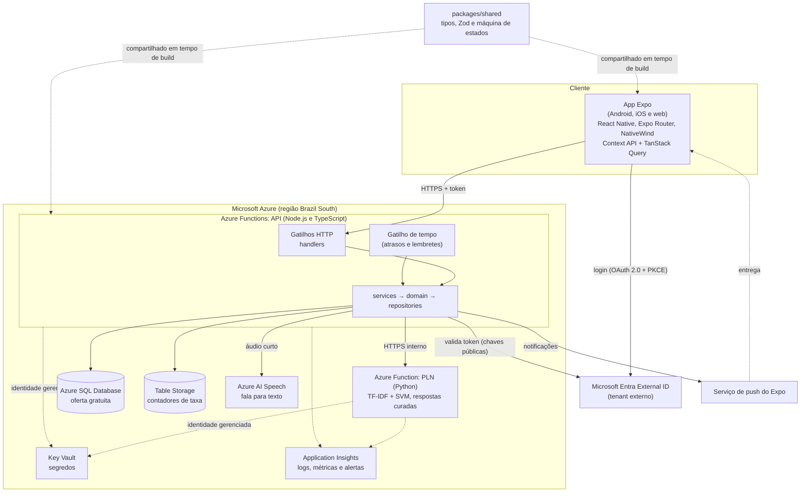

# Diagrama de arquitetura

Item do Jira: SCRUM-31. Atende à seção 4.1 do modelo de Documentação Técnica (visão geral e arquitetura). Decisões: ADR-001 a ADR-010 em `docs/05-adrs/`.

## Visão geral

Arquitetura **cliente-servidor serverless** na Azure: um app único (Android, iOS e web) fala por HTTPS com uma API em Azure Functions. A API usa o Azure SQL para os dados, um serviço de PLN separado (Python) para chatbot e busca, o Azure AI Speech para voz e o Entra External ID para identidade. Segredos ficam no Key Vault e a telemetria no Application Insights.

## Diagrama de blocos

Legenda: linhas contínuas são chamadas em tempo de execução; tracejadas são acesso a segredos e telemetria por identidade gerenciada, ou código compartilhado no build.

## Componentes

| Componente | Responsabilidade | Decisão |
|---|---|---|
| App Expo | Telas, navegação, sessão (Context API), cache de dados (TanStack Query) e coleta de áudio | ADR-006 |
| API (Azure Functions) | Regras de negócio e acesso a dados, em camadas; rotina diária por gatilho de tempo | ADR-001 |
| PLN (Azure Function Python) | Classificação de intenções e respostas curadas; busca semântica | ADR-002 |
| Azure AI Speech | Transcrição de áudio em português, sem armazenar o áudio | ADR-003 |
| Azure SQL Database | Dados relacionais (usuário, membros, calendário, doses, eventos) | ADR-004 |
| Entra External ID | Cadastro, login e emissão de tokens | ADR-005 |
| Pacote compartilhado | Contratos únicos entre app e API; domínio puro | ADR-007 |
| Key Vault e Application Insights | Segredos e observabilidade | ADR-008 |
| Table Storage | Contadores de limitação de taxa | ADR-010 |
| Serviço de push do Expo | Entrega de lembretes aos dispositivos | Plano padrão do SCRUM-31 |

## Pontos de segurança na arquitetura

- Todo tráfego em HTTPS; CORS restrito e cabeçalhos de segurança na API.
- A API nunca recebe a senha; valida o token do Entra a cada requisição e verifica a propriedade dos dados em todo acesso.
- O app não tem segredos; chaves ficam no Key Vault, acessadas por identidade gerenciada.
- O serviço de PLN não é exposto ao app: só a API o chama.
- Logs e telemetria sem dados pessoais.
- Limitação de taxa por usuário nos endpoints de voz e de chatbot.

## Ambiente local (Docker)

`docker compose up` sobe a API, o PLN e o Azurite (armazenamento local, inclusive Table Storage), para desenvolver e testar sem depender da nuvem (RNF08).

## Pendências desta visão

- Serviço de push do Expo e o plano de envio por plataforma são o **padrão adotado** neste SCRUM; se o autor preferir e-mail, a arquitetura ganha um serviço de envio e o banco passa a guardar o e-mail (impacto em LGPD).
- O desenho de rede entre a API e o PLN (chave de função ou identidade gerenciada) será definido no SCRUM-21.
