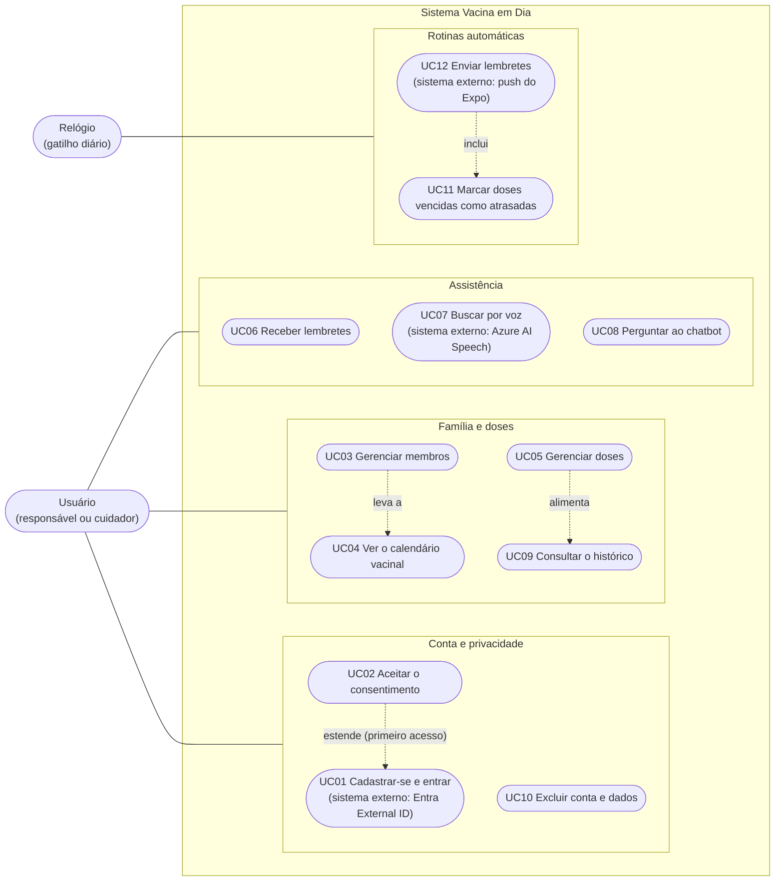

# Diagrama de casos de uso

Item do Jira: SCRUM-31. Requisitos: `docs/02-requisitos.md`. Personas: PE1 Mariana, PE2 Sr. José, PE3 Carla.

O Mermaid não tem diagrama de casos de uso nativo; usamos um fluxograma, com os atores fora da fronteira do sistema e os casos de uso em elipses.

## Diagrama (MVP, RF01 a RF09)

Legenda: a linha contínua liga o ator ao grupo de casos de uso; os sistemas externos aparecem entre parênteses no caso de uso em que participam; as setas tracejadas indicam dependência: "inclui" e "estende" seguem a notação UML (o caso incluído sempre ocorre; o caso que estende só ocorre sob uma condição, aqui o primeiro acesso), enquanto "leva a" e "alimenta" apenas mostram a relação entre os casos. Cada ator ligado a um grupo participa de todos os casos de uso daquele grupo, exceto o do Relógio, que só aciona o grupo de rotinas automáticas. O UC06 (receber lembretes) é o lado do usuário do UC12.

## Descrição dos casos de uso

| ID | Caso de uso | Ator principal | Requisito | Resumo |
|---|---|---|---|---|
| UC01 | Cadastrar-se e entrar | Usuário | RF01 | Cria a conta e autentica por e-mail e senha no Entra External ID; no primeiro acesso, passa pelo consentimento (UC02). |
| UC02 | Aceitar o consentimento | Usuário | RF09 | Lê o termo em linguagem simples e aceita; o aceite é registrado com versão e data. Para membros menores, declara ser o responsável. |
| UC03 | Gerenciar membros | Usuário | RF02 | Inclui, edita e exclui membros (nome ou apelido, data de nascimento e, opcionalmente, grupo específico). Ao incluir, o sistema gera as doses do calendário. |
| UC04 | Ver o calendário vacinal | Usuário | RF03 | Exibe as doses por faixa etária, com fonte e versão do calendário e o aviso de que o app não substitui a caderneta nem a orientação profissional. |
| UC05 | Gerenciar doses | Usuário | RF04 | Agenda, desagenda, reagenda, registra a aplicação ou cancela (com confirmação), conforme a máquina de estados (`estados-dose.md`). |
| UC06 | Receber lembretes | Usuário | RF05 | Recebe aviso de dose próxima e vê a sinalização de doses atrasadas no app. |
| UC07 | Buscar por voz | Usuário | RF06 | Fala a pergunta; o áudio é transcrito (Azure AI Speech) e alimenta a busca sobre vacinas e calendário. Se falhar, permite digitar. |
| UC08 | Perguntar ao chatbot | Usuário | RF07 | Faz uma pergunta; o serviço de PLN classifica a intenção e devolve resposta curada com fonte, ou a resposta padrão se a confiança for baixa. |
| UC09 | Consultar o histórico | Usuário | RF08 | Lista as doses aplicadas de cada membro, com vacina, dose e data. |
| UC10 | Excluir conta e dados | Usuário | RF09 | Remove a conta, os membros, as doses, os consentimentos e o usuário no Entra. |
| UC11 | Marcar doses vencidas como atrasadas | Relógio | RF04, RF05 | Rotina diária que aplica T4 e T7 às doses com data vencida; o cliente nunca atrasa uma dose. |
| UC12 | Enviar lembretes | Relógio | RF05 | Rotina diária que envia push das doses próximas e atrasadas, sem repetir o mesmo aviso. |

## Observações

- A versão completa (RF10 a RF12: mapa de UBS, exportar PDF e compartilhar com cuidador) fica fora deste diagrama. O compartilhamento, em especial, criaria um segundo ator (Cuidador) e mudaria o modelo de dados; será modelado se o escopo for aprovado.
- Não há ator "Profissional de saúde": o app não é voltado a profissionais e não faz orientação médica individual.
