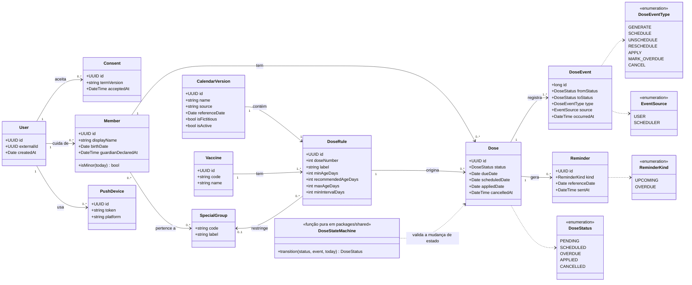

# Diagrama de classes (domínio)

Item do Jira: SCRUM-31. O diagrama mostra o **modelo de domínio**, isto é, os conceitos do negócio e suas relações. As tabelas do banco estão em `der.md`; a máquina de estados da dose, em `estados-dose.md`.

Nomes de classes e atributos em inglês, como no código (`CLAUDE.md` §7); rótulos e descrições em português.

## Diagrama

## Regras de negócio no modelo

| Regra | Onde vive |
|---|---|
| Transições válidas, guardas de data e confirmação do cancelamento | `DoseStateMachine` (função pura, recebe o "hoje" por parâmetro) |
| Atraso (T4 e T7) só pela rotina diária | Evento `MARK_OVERDUE` com origem `SCHEDULER`; o cliente não pode enviá-lo |
| Uma dose por regra e por membro (não duplicar ao gerar de novo) | Restrição única `(member, doseRule)` |
| Membro menor exige declaração de responsável | `Member.guardianDeclaredAt` preenchido quando `isMinor(today)` |
| Cada usuário só acessa os próprios dados | Toda consulta parte de `User` e verifica a propriedade (`CLAUDE.md` §10) |
| Calendário versionado, com fonte e data | `CalendarVersion`; `isFictitious` marca dados de exemplo |

## Decisões de modelagem

- `User` guarda **apenas o identificador opaco** do Entra (`externalId`); nome e e-mail ficam no Entra (ADR-005).
- `DoseRule` aponta para uma `CalendarVersion`; ao trocar a versão do calendário, as doses já geradas continuam ligadas à regra antiga (histórico preservado).
- `DoseEvent` é um registro de auditoria sem dado pessoal; permite reconstruir o ciclo da dose e apoia os testes.
- Mensagens do chatbot e transcrições de voz **não** são persistidas e, portanto, não aparecem no modelo.
