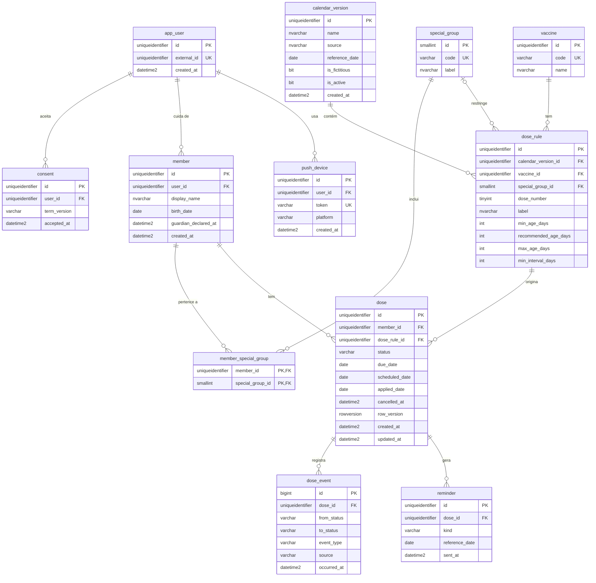

# Diagrama Entidade-Relacionamento (DER) do Azure SQL

Item do Jira: SCRUM-31. Atende à seção 5.1 do modelo de Documentação Técnica. A descrição de cada tabela e atributo, com tipos, está em `dicionario-de-dados.md` (seção 5.2).

Convenções: identificadores em inglês, `snake_case`; chaves primárias do tipo `UNIQUEIDENTIFIER` (exceto `dose_event`, que usa `BIGINT`); datas civis em `DATE` (sem fuso, no calendário do Brasil) e instantes em `DATETIME2` em UTC.

## Diagrama

## Regras de integridade

| Regra | Como é garantida |
|---|---|
| Uma dose por regra e por membro (não duplicar ao gerar de novo; caso CT-G09) | Restrição única `(member_id, dose_rule_id)` em `dose` |
| Estado válido | `CHECK` de `status` em `PENDING`, `SCHEDULED`, `OVERDUE`, `APPLIED` e `CANCELLED` |
| Dados coerentes com o estado | `CHECK`: `SCHEDULED` exige `scheduled_date`; `APPLIED` exige `applied_date`; `CANCELLED` exige `cancelled_at`; `PENDING` não tem `scheduled_date` |
| Regras de data relativas a "hoje" (agendar `>=` hoje, aplicar `<=` hoje) | **Não** ficam no banco; vivem na máquina de estados (`packages/shared`), que recebe o "hoje" por parâmetro |
| Cada usuário só acessa os próprios dados | Toda consulta junta a tabela ao `user_id` do usuário autenticado (verificado na camada de repositório) |
| Exclusão de conta remove tudo (RF09) | `ON DELETE CASCADE` de `app_user` para `consent`, `member` e `push_device`; de `member` para `dose` e `member_special_group`; de `dose` para `dose_event` e `reminder` |
| Calendário não pode ser apagado se há doses | `dose_rule` não tem exclusão em cascata a partir de `dose`; apagar uma regra em uso é impedido |
| Lembrete não duplicado | Restrição única `(dose_id, kind, reference_date)` em `reminder` |
| Token de push único | Restrição única em `push_device.token` |
| Concorrência | `row_version` em `dose`, verificada em toda atualização |
| Calendário ativo | No máximo uma `calendar_version` com `is_active = 1` (índice único filtrado) |

## Índices principais

| Tabela | Índice | Para quê |
|---|---|---|
| `dose` | `(member_id, status)` | Listar doses de um membro por estado e montar o histórico |
| `dose` | `(status, due_date)` | Rotina diária: encontrar doses `PENDING` vencidas (T4) |
| `dose` | `(status, scheduled_date)` | Rotina diária: encontrar doses `SCHEDULED` vencidas (T7) |
| `dose_event` | `(dose_id, occurred_at)` | Reconstruir o ciclo de uma dose |
| `app_user` | `external_id` (único) | Localizar o usuário pelo identificador do Entra |

## O que **não** está no banco (de propósito)

- **Nome, e-mail e senha do usuário:** ficam no Entra (ADR-005). O banco guarda só o identificador opaco.
- **CPF e Cartão Nacional de Saúde:** nunca coletados (`CLAUDE.md` §10).
- **Mensagens do chatbot, transcrições e áudio da voz:** não são persistidos (LGPD, ADR-003).
- **Contadores de limitação de taxa:** ficam no Table Storage, não no SQL, para não manter o banco ativo e consumir a franquia gratuita (ADR-010).
- **Dataset de intenções do chatbot:** versionado como arquivo no repositório (`apps/nlp`).

## Observações

- `display_name` aceita nome ou apelido (minimização de dados). A data de nascimento é necessária para calcular a faixa etária do calendário.
- Um membro **menor de idade** exige `guardian_declared_at` preenchido (declaração do responsável); a regra é aplicada no serviço, pois depende da data de hoje.
- Os dados de `vaccine`, `dose_rule` e `calendar_version` serão carregados por *seed* versionado. Enquanto não houver o dado oficial do PNI confirmado pelo autor, o *seed* tem `is_fictitious = 1` e é claramente marcado como exemplo.
- O script SQL de criação (migrações) será criado no setup do banco (SCRUM-22); este DER é o seu insumo.
