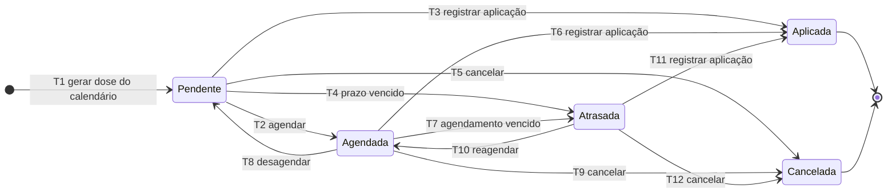
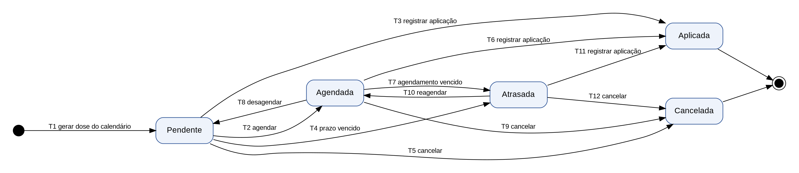

# Diagrama de estados: ciclo de vida da dose (RF04)

Funcionalidade com mais de 3 estados (exceto login), escolhida para a entrega de Qualidade e Testes de Software.
Itens do Jira: SCRUM-18 (história RF04) e SCRUM-29 (UML de estados e casos de teste).

## Diagrama

Versão em imagem (para os PDFs de documentação): `estados-dose.png` e `estados-dose.svg`.

## Estados

| Estado | Significado | Tipo |
|---|---|---|
| Pendente | Dose prevista pelo calendário, ainda sem data marcada e sem aplicação | Inicial |
| Agendada | O usuário marcou uma data para tomar a dose | Intermediário |
| Atrasada | A data prevista ou agendada passou sem registro de aplicação | Intermediário |
| Aplicada | A aplicação foi registrada e a dose entra no histórico | Final |
| Cancelada | A dose deixou de ser necessária para o membro | Final |

## Transições

| ID | Origem | Destino | Evento | Condição (guarda) |
|---|---|---|---|---|
| T1 | (inicial) | Pendente | Dose gerada a partir do calendário do membro | Membro cadastrado; vacina indicada para a faixa etária |
| T2 | Pendente | Agendada | Usuário agenda | Data de agendamento maior ou igual a hoje |
| T3 | Pendente | Aplicada | Usuário registra aplicação | Data de aplicação não pode ser futura |
| T4 | Pendente | Atrasada | Prazo vencido (automático, gatilho por tempo) | Data prevista anterior a hoje e sem aplicação |
| T5 | Pendente | Cancelada | Usuário cancela | Confirmação do usuário |
| T6 | Agendada | Aplicada | Usuário registra aplicação | Data de aplicação não pode ser futura |
| T7 | Agendada | Atrasada | Agendamento vencido (automático) | Data agendada anterior a hoje e sem aplicação |
| T8 | Agendada | Pendente | Usuário remove o agendamento | Existe agendamento |
| T9 | Agendada | Cancelada | Usuário cancela | Confirmação do usuário |
| T10 | Atrasada | Agendada | Usuário reagenda | Nova data maior ou igual a hoje |
| T11 | Atrasada | Aplicada | Usuário registra aplicação tardia | Data de aplicação não pode ser futura |
| T12 | Atrasada | Cancelada | Usuário cancela | Confirmação do usuário |

## Transições inválidas (devem ser rejeitadas pelo sistema)

| Tentativa | Motivo |
|---|---|
| Aplicada para qualquer estado | Estado final |
| Cancelada para qualquer estado | Estado final |
| Pendente para Pendente | Não há mudança de estado |
| Agendada para Agendada | Alterar a data é desagendar (T8) e agendar de novo (T2) |
| Atrasada para Pendente | Uma dose vencida só pode ser reagendada, aplicada ou cancelada |
| Qualquer estado para Atrasada sem prazo vencido | O evento de atraso depende da data |

## Base para a cobertura de testes (SCRUM-29)

- **Cobertura de estados:** 5 de 5 (Pendente, Agendada, Atrasada, Aplicada, Cancelada).
- **Cobertura de transições:** T1 a T12, mais as duas saídas para o estado final, além das transições inválidas da tabela acima.
- **Caminhos sugeridos:**

| Caminho | Sequência |
|---|---|
| C1 | T1, T3 (aplicação direta) |
| C2 | T1, T2, T6 (agendar e aplicar) |
| C3 | T1, T4, T11 (atrasar e aplicar tarde) |
| C4 | T1, T2, T7, T10, T6 (agendar, atrasar, reagendar e aplicar) |
| C5 | T1, T2, T8, T5 (agendar, desagendar e cancelar) |
| C6 | T1, T4, T12 (atrasar e cancelar) |
| C7 | T1, T4, T10, T7, T10, T6 (ciclo entre atrasada e agendada, antes de aplicar) |

Os casos de teste correspondentes estão em `docs/07-testes/casos-teste-estados-dose.md`.

## Decisões de modelagem a validar

- Aplicada e Cancelada são estados finais. Corrigir um registro errado fica fora do escopo do MVP.
- O atraso (T4 e T7) é calculado por um gatilho por tempo na Azure Function, o mesmo usado nos lembretes (RF05).
- O diagrama em Mermaid é a fonte versionada no repositório; a imagem é gerada a partir da mesma lista de transições.
