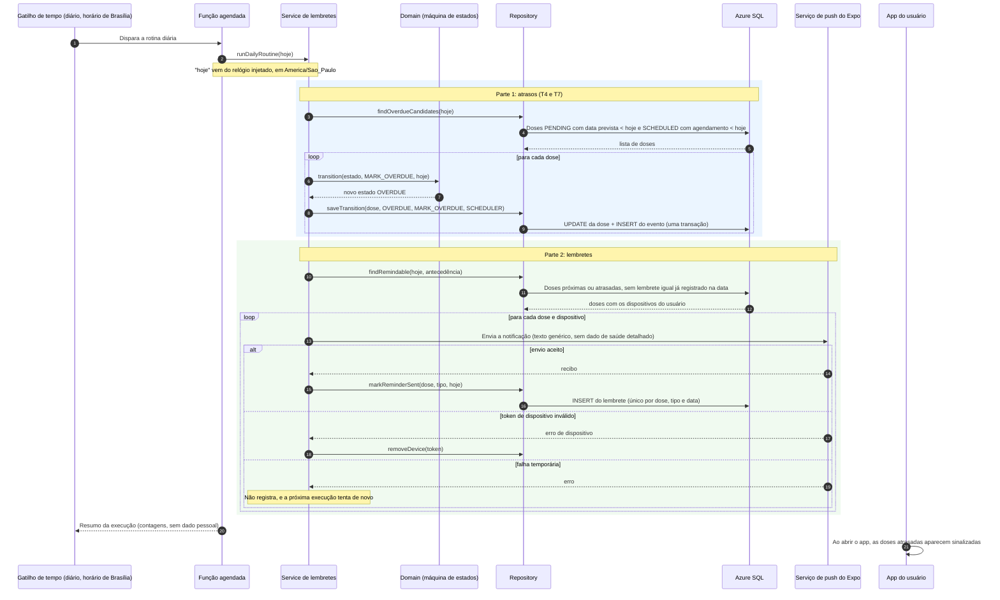

# Diagrama de sequência: marcar atrasos e enviar lembretes (RF05 e RF04)

Item do Jira: SCRUM-31. Este fluxo é disparado por **tempo**, não pelo usuário. Ele aplica o atraso (T4 e T7), que só a rotina pode fazer, e envia os lembretes por notificação push.

## Pontos de atenção

- **Atraso só pela rotina:** o cliente nunca envia `MARK_OVERDUE`; a regra está na máquina de estados e é testada com relógio controlado (casos CT-T04, CT-T07 e CT-G05/G06).
- **Idempotência:** a restrição única do lembrete (dose, tipo, data) impede avisos duplicados se a rotina rodar duas vezes no mesmo dia.
- **Privacidade da notificação:** o texto da notificação push é genérico (por exemplo, "Você tem uma vacina para conferir"), sem nome do membro nem da vacina, porque a notificação pode aparecer na tela bloqueada e passa por um serviço externo.
- **Web:** o push do Expo não cobre a web; lá o usuário vê a sinalização ao abrir o app (limitação aceita no SCRUM-31: lembrete por push no celular e sinalização dentro do app nas duas plataformas).
- **Resiliência:** uma dose que falha não impede as demais; os erros são registrados no Application Insights sem dados pessoais.
- **Quanto antes avisar** ("antecedência") é um parâmetro de configuração a validar com o autor; não está fixado neste documento.
