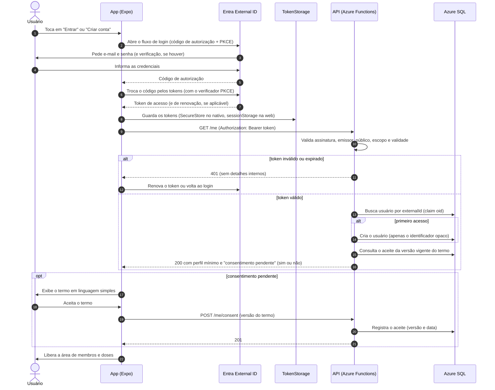

# Diagrama de sequência: cadastro, login e primeiro acesso (RF01 e RF09)

Item do Jira: SCRUM-31. Decisões relacionadas: ADR-005 (Entra External ID) e ADR-009 (armazenamento do token).

A senha **nunca** passa pela API: o app autentica direto no Entra External ID (fluxo OAuth 2.0 com PKCE) e envia à API apenas o token de acesso.

## Pontos de atenção

- **LGPD:** sem aceite da versão vigente do termo, a API recusa os demais endpoints de dados com um erro específico (por exemplo, 403 com o código `CONSENT_REQUIRED`); o app leva o usuário à tela de consentimento.
- **Logs:** a API registra apenas o identificador opaco do usuário e o resultado; nunca o token, o e-mail ou o nome.
- **Limitação de tentativas de login:** é do Entra (ADR-010); a API não vê credenciais.
- **Rotas e códigos** acima são exemplos para ilustrar o fluxo; o contrato definitivo da API entra na Documentação Técnica.
- O ADR-005 deixa em aberto a biblioteca de login por plataforma (MSAL ou `expo-auth-session`); a decisão é do SCRUM-13.
