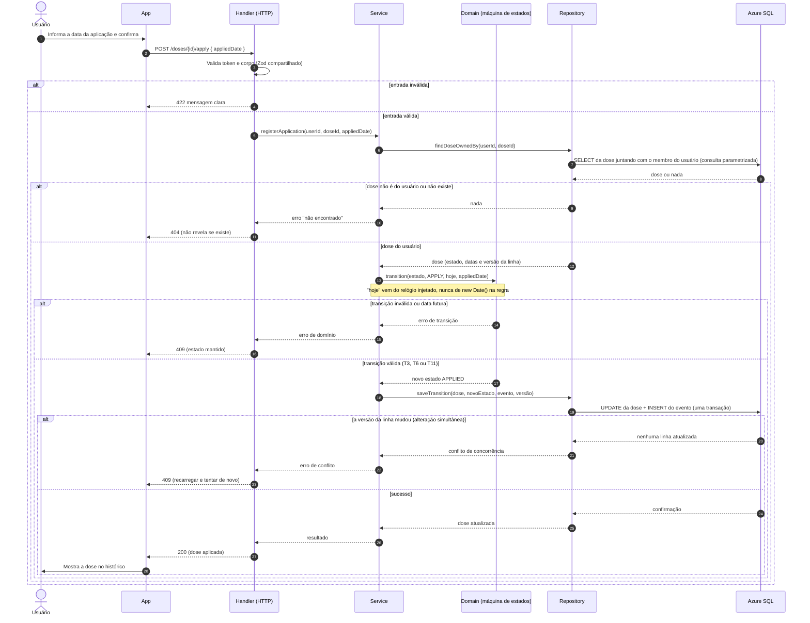

# Diagrama de sequência: registrar a aplicação de uma dose (RF04)

Item do Jira: SCRUM-31. Regras de transição: `estados-dose.md` (T3, T6 e T11). A estrutura segue as camadas da API: `handler` (HTTP) → `service` (caso de uso) → `domain` (regra pura) → `repository` (acesso a dados).

## Pontos de atenção

- **Propriedade dos dados:** a busca da dose já filtra pelo usuário autenticado, então um identificador de outro usuário devolve 404, como se não existisse. O identificador vindo do cliente nunca é confiado sozinho (`CLAUDE.md` §10).
- **Erros:** os erros de domínio (entrada, não encontrado, transição, conflito) são mapeados para HTTP em **um único ponto**, e a mensagem devolvida ao cliente nunca expõe detalhes internos.
- **Transação:** a mudança de estado e o registro do evento acontecem juntos; se um falhar, nada é gravado.
- **Concorrência:** a coluna de versão da linha evita que duas requisições simultâneas gravem por cima uma da outra.
- **Cancelar** segue o mesmo fluxo, com o parâmetro de confirmação exigido pela regra (T5, T9 e T12); **agendar, desagendar e reagendar** também.
- Rotas e códigos são exemplos; o contrato definitivo entra na Documentação Técnica.
